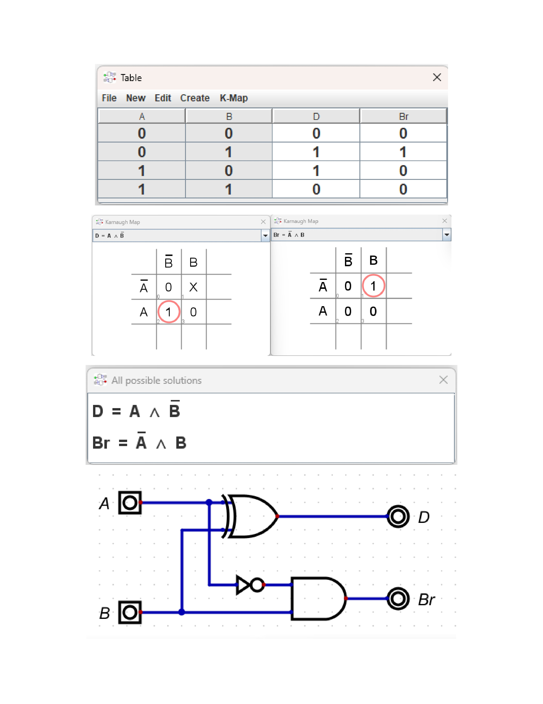
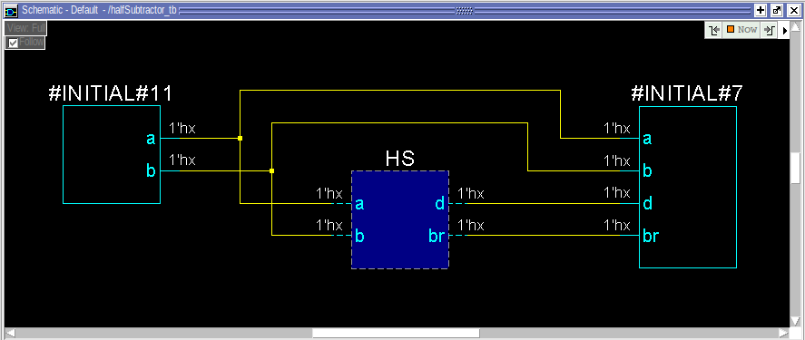
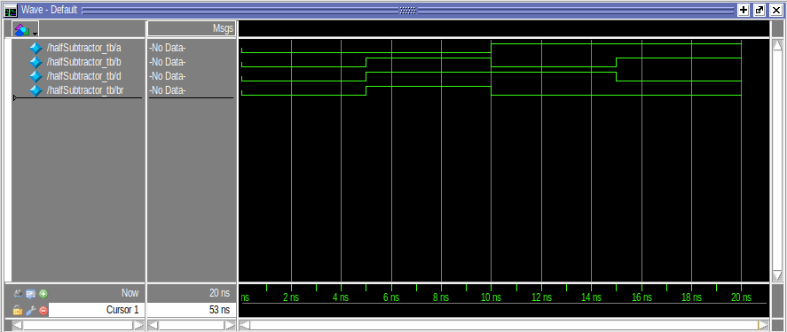

# Half Subtractor – Verilog Implementation

## 1. Overview

This project contains a complete Verilog implementation of a **Half Subtractor**, including RTL design, testbench, simulation output, and theory resources.

A Half Subtractor performs single-bit subtraction:

- Difference (D) = A XOR B  
- Borrow (B_out) = (~A) & B

This project is useful for students learning digital logic and HDL design.

---

## 2. Project Structure

```
halfsubtractor/
├── scr/
│   ├── rtl/
│   │   └── halfsubtractor.v
│
├── sim/
│   ├── result/
|       ├──images/
|          └──halfSubtractorSchematic.png
|          └──halfSubtractorgatelevelSchematic.png
|          └──halfSubtractorwave.png
│   ├── testbench/
|       └──halfSubtractor_tb.v
|
|
├── theory/
│   └── halfSubtractor.jpg

│
└── README.txt
```

---

## 3. Included Images

### Block Diagram  


### Schematic  


### Simulation Waveform  


---

## 4. File Descriptions

### 4.1 RTL Source  
**File:** `scr/rtl/halfsubtractor.v`  
Contains the Verilog module implementing:

```
Difference = A ^ B
Borrow     = (~A) & B
```

---

### 4.2 Testbench  
**File:** `scr/test/halfsubtractor_tb.v`  
Uses all input combinations (00, 01, 10, 11) to verify the Half Subtractor and generate waveform output.

---

### 4.3 Simulation Files  
**Folder:** `sim/`  
Contains:

- `waveform.png` → Simulation waveform
- `dump.vcd` → GTKWave compatible signal file

---

### 4.4 Theory Documents  
**Folder:** `theory/`  
Includes conceptual materials:

- Block diagram  
- Truth table  
- Documentation PDF  

Useful for academic reports.

---

## 5. How to Run the Simulation

### Using Icarus Verilog

```
iverilog -o output scr/rtl/halfsubtractor.v scr/test/halfsubtractor_tb.v
vvp output
```

View waveform using GTKWave:

```
gtkwave dump.vcd
```

---

### Using ModelSim / QuestaSim

```
vlog scr/rtl/*.v
vlog scr/test/*.v
vsim halfsubtractor_tb
run -all
```

---

## 6. Purpose

This project demonstrates:

- Basic digital logic design
- Verilog RTL coding
- Testbench creation
- Simulation and waveform analysis
- Professional folder structure for HDL projects

---

## 7. Author

**Koustav Das**  
Electronics • Verilog • Digital Logic • Embedded Systems

---

## ⭐ If you find this helpful, please star the repository!
